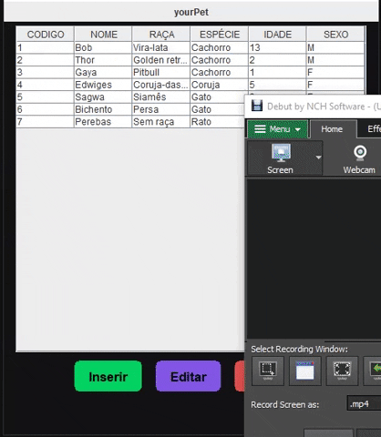

<div align="center">
  
</div>

> *Register and have control of your Pets!* 😊


---

This project was developed for the **Programming 2 class**, in the **Computer Information Systems** course 
at **Universidade Estadual de Goiás**

### 💬 Purpose
The objective of this project was to know the main functions of Java Swing and use a database...
- Manipulate and style graphic elements
- Generate actions on buttons
- Practice the separation of responsibilities 
- Create an architecture for development
- Connect to a database
- Manipulate data types
- Handling errors and exceptions

---
### 📁 How to download and run this project
> First, clone this repository
```
$ git clone https://github.com/juliocesarfs/yourPet.git
```
> Make sure you have [Postgree](https://www.postgresql.org/) installed

> Create the database table based on the script in <**banco**> folder

After this, *just run App.java in <**app**> package*.

# 📕 License

This project is under the [MIT license](https://github.com/juliocesarfs/yourPet/blob/master/LICENSE)

Made with 💜 by [*Júlio César*](https://github.com/juliocesarfs) 🚀

